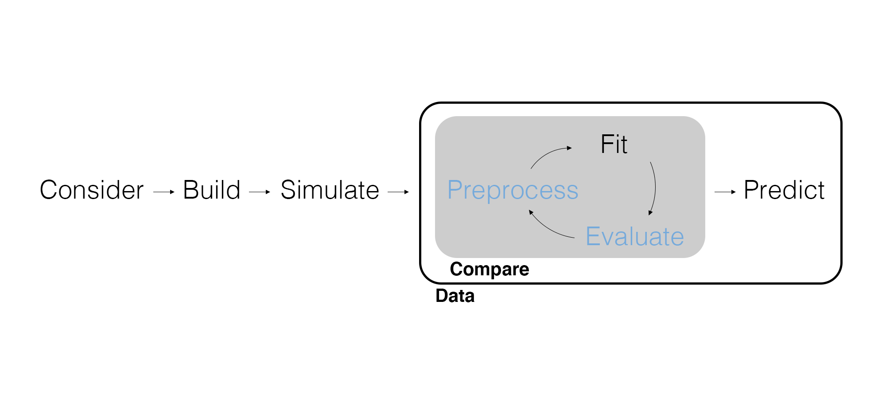

## Marketing Analytics Process

<center>
{width="900px"}
</center>

## Inferential Modeling Workflow

<center>
{width=900px}
</center>

---

{width=850px}

## Review the Workflow

<center>
{width=900px}
</center>

## Model Comparison Redux

Remember that we use a measure of *overall model fit* to compare how well different models fit the same data. But there's a problem.

- As we add explanatory variables a model will fit the data better.
- The explanatory variables *don't have to be correlated with our dependent varible*: More is better.

Why would this be a problem? Think about what we're doing with inferential models.

---

```{r message=FALSE}
# Load packages.
library(tidyverse)
library(tidymodels)

# Import soup data.
soup_data <- read_csv(here::here("Data", "soup_data.csv")) |> 
  select(Sales, Any_Disp_Spend, Any_Feat_Spend, Any_Price_Decr_Spend)

# Fit a model.
fit_01 <- linear_reg() |> 
  set_engine("lm") |> 
  fit(
    Sales ~ Any_Disp_Spend + Any_Feat_Spend + Any_Price_Decr_Spend, 
    data = soup_data
  )
```

---

```{r eval=FALSE}
# Visualize just the slope parameter estimates.
tidy(fit_01, conf.int = TRUE) |> 
  filter(term != "(Intercept)") |>
  ggplot(aes(x = term)) + 
  geom_point(aes(y = estimate)) + 
  geom_errorbar(aes(ymin = conf.low, ymax = conf.high), width = .1) +
  geom_hline(yintercept = 0, color = "red")
```

---

```{r echo=FALSE}
# Visualize just the slope parameter estimates.
tidy(fit_01, conf.int = TRUE) |> 
  filter(term != "(Intercept)") |>
  ggplot(aes(x = term)) + 
  geom_point(aes(y = estimate)) + 
  geom_errorbar(aes(ymin = conf.low, ymax = conf.high), width = .1) +
  geom_hline(yintercept = 0, color = "red")
```

---

```{r echo=FALSE}
set.seed(7)
```


```{r}
# Let's add a nonsense variable.
soup_data <- soup_data |> 
  mutate(nonsense_01 = rnorm(nrow(soup_data), mean = 0, sd = 1))

# Fit a model with a nonsense variable.
fit_02 <- linear_reg() |> 
  set_engine("lm") |> 
  fit(
    Sales ~ Any_Disp_Spend + Any_Feat_Spend + Any_Price_Decr_Spend + nonsense_01, 
    data = soup_data
  )
```

---

```{r eval=FALSE}
# Visualize just the slope parameter estimates.
tidy(fit_02, conf.int = TRUE) |> 
  filter(term != "(Intercept)") |>
  ggplot(aes(x = term)) + 
  geom_point(aes(y = estimate)) + 
  geom_errorbar(aes(ymin = conf.low, ymax = conf.high), width = .1) +
  geom_hline(yintercept = 0, color = "red")
```

---

```{r echo=FALSE}
# Visualize just the slope parameter estimates.
tidy(fit_02, conf.int = TRUE) |> 
  filter(term != "(Intercept)") |>
  ggplot(aes(x = term)) + 
  geom_point(aes(y = estimate)) + 
  geom_errorbar(aes(ymin = conf.low, ymax = conf.high), width = .1) +
  geom_hline(yintercept = 0, color = "red")
```

---

```{r}
# MORE!
soup_data <- soup_data |> 
  mutate(
    nonsense_02 = rnorm(nrow(soup_data), mean = 50, sd = 10),
    nonsense_03 = rnorm(nrow(soup_data), mean = -10, sd = 20),
    nonsense_04 = rnorm(nrow(soup_data), mean = 100, sd = 100),
    nonsense_05 = runif(nrow(soup_data), min = -5, max = 5),
    nonsense_06 = runif(nrow(soup_data), min = 25, max = 500),
    nonsense_07 = runif(nrow(soup_data), min = -50, max = 10),
    nonsense_08 = rbinom(nrow(soup_data), size = 1, prob = 0.25),
    nonsense_09 = rbinom(nrow(soup_data), size = 3, prob = 0.10),
    nonsense_10 = rbinom(nrow(soup_data), size = 7, prob = 0.85)
  )
```

---

```{r}
# MORE!
fit_03 <- linear_reg() |> 
  set_engine("lm") |> 
  fit(
    Sales ~ ., 
    data = soup_data
  )
```

---

```{r eval=FALSE}
# Visualize just the slope parameter estimates.
tidy(fit_03, conf.int = TRUE) |> 
  filter(term != "(Intercept)") |>
  ggplot(aes(x = term)) + 
  geom_point(aes(y = estimate)) + 
  geom_errorbar(aes(ymin = conf.low, ymax = conf.high), width = .1) +
  geom_hline(yintercept = 0, color = "red") + 
  theme(axis.text.x = element_text(angle = 45, hjust=1))
```

---

```{r echo=FALSE}
# Visualize just the slope parameter estimates.
tidy(fit_03, conf.int = TRUE) |> 
  filter(term != "(Intercept)") |>
  ggplot(aes(x = term)) + 
  geom_point(aes(y = estimate)) + 
  geom_errorbar(aes(ymin = conf.low, ymax = conf.high), width = .1) +
  geom_hline(yintercept = 0, color = "red") + 
  theme(axis.text.x = element_text(angle = 45, hjust=1))
```

---

We already have the $R^2$, the percent of variation in $y$ that can be explained by the explanatory variables. Because this is easy to abuse, we can use the **Adjusted $R^2$**, which is adjusted based on the number of explanatory variables.

```{r eval=FALSE}
# Compare overall model fit.
bind_rows(
  glance(fit_01),
  glance(fit_02),
  glance(fit_03)
)
```

```{r echo=FALSE}
bind_rows(
  glance(fit_01),
  glance(fit_02),
  glance(fit_03)
) |> 
  select(r.squared:logLik) |> 
  as.data.frame()
```

Both $R^2$ and Adjusted $R^2$ aren't great. We need better measures of overall model fit.

## Underfitting and Overfitting

Remember that we want to understand an unobserved data generating process. The data we observe is just one realization of that process. As such, we don't want to learn too little *or* too much from our data.

This is called **underfitting** and **overfitting**, respectively, with the latter the problem we've just demonstrated.

<center>
{width=800px}
</center>

## Predictive Fit

Instead of measuring how well a model fits the *data*, we can measure how well a model *predicts*. Why should this help?

- A model can't overfit to data it hasn't seen.
- A model that is doing a better job of modeling the data generating process should be able to do a better job at predicting data generated by that same process.

## Data Splitting

In order to compute predictive fit, we need to split the data into **training** data (used to fit the model) and **testing** data (used to compute predictive fit).

```{r}
# Set the randomization seed.
set.seed(42)

# Split the data.
soup_split <- initial_split(soup_data, prop = 0.90)

soup_split
```

`initial_split()` appends 'meta-information' for other functions to use (i.e., which observations are contained in the train and test data sets).

---

We can access the training data with `training()`.

```{r}
# Access the training data.
training(soup_split)
```

---

We can access the testing data with `testing()`.

```{r}
# Access the testing data.
testing(soup_split)
```

## Fit with Training Data

We fit the model as before, but we now only use the *training data* to fit (i.e., train) the model.

```{r}
# Fit a model with training data.
fit_01 <- linear_reg() |> 
  set_engine("lm") |> 
  fit(
    Sales ~ Any_Disp_Spend + Any_Feat_Spend + Any_Price_Decr_Spend, 
    data = training(soup_split)
  )

# MORE with training data.
fit_03 <- linear_reg() |> 
  set_engine("lm") |> 
  fit(
    Sales ~ ., 
    data = training(soup_split)
  )
```

## Predict with Testing Data

Now we use `predict()` for model comparison where the `new_data` is the testing data. We compare the predicted outcome to the *actual* outcome and compute the **root mean squared error** (RMSE), a squared average of the difference between the truth and our estimate. Closer to 0 is better!

```{r}
# Compute predictive fit.
fit_01 |> 
  predict(new_data = testing(soup_split)) |>
  bind_cols(testing(soup_split)) |>
  rmse(truth = Sales, estimate = .pred)
```

---

```{r}
fit_03 |> 
  predict(new_data = testing(soup_split)) |>
  bind_cols(testing(soup_split)) |>
  rmse(truth = Sales, estimate = .pred)
```

According to RMSE, the model overfit with the nonsense explanatory variables is no longer the best-fitting model.

## Wrapping Up

*Summary*

- Discussed overfitting (and underfitting).
- Introduced splitting data.
- Argued that predictive fit can't be as easily fooled.

*Next Time*

- Completing the inferential workflow with preprocessing data.

*Supplementary Material*

- *Tidy Modeling with R* Chapter 9.1-9.2

## Exercise 12

Return to `soup_data` and the models from the previous exercise.

1. Split the data with 0.90 of the data in the training data *in order* using `initial_time_split()`.
2. Fit the baseline model (with no nonsense variables) and a model with 10 nonsense variables again on the training data.
3. Compute the RMSE using the testing data.
4. Identify the best-fitting model based on $R^2$, Adjusted $R^2$, and RMSE. Is it the same? Why or why not?
5. Render the Quarto document into Word and upload to Canvas.

